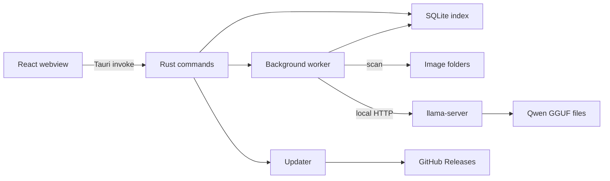

# Architecture

Image Tag Manager is a Tauri desktop app. React runs in its webview. Rust reads image
folders, maintains the SQLite index, runs local classification, and handles updates.
The frontend calls Rust through Tauri commands; it does not open the image database
or call the model server itself.

## Components

| Component | Frameworks and libraries | Role |
| --- | --- | --- |
| [Frontend](../src/App.tsx) | React 19, TypeScript, Vite, Tailwind CSS 4, Radix-based components | Search, image grid and viewer, editing, task controls, and options. TanStack Query caches command results; TanStack Virtual renders visible grid rows. |
| [Desktop bridge](../src-tauri/src/desktop.rs) | Tauri 2, Rust | Registers commands called through [`src/lib/api.ts`](../src/lib/api.ts). Owns native dialogs, clipboard, file opening, and the shared worker state. |
| [Index](../src-tauri/src/db.rs) | rusqlite, SQLite, FTS5, WalkDir | Scans configured folders, stores image metadata and settings, serves paginated search, and caches thumbnails. [Refinery migrations](../src-tauri/migrations/README.md) define the schema. |
| [Worker](../src-tauri/src/engine.rs) | Rust threads | Runs one scan, download, or classification task at a time. Tracks progress, cancellation, and automatic work. |
| [Inference](../src-tauri/src/inference.rs) | llama.cpp `llama-server`, Qwen3-VL-2B GGUF, reqwest | Downloads and checks model files, prepares images, starts the bundled server, and sends classification requests over loopback HTTP. |
| [Updates](../src-tauri/src/updates.rs) | Tauri updater, GitHub Releases | Checks release metadata, downloads and verifies signed packages, and activates a staged update on the next launch. |

## Data flow

At startup, Tauri [sets up the app](../src-tauri/src/desktop.rs), opens the per-user
database, applies pending migrations, starts the worker monitor, and shows the
window. React uses the typed functions in [`src/lib/api.ts`](../src/lib/api.ts) to
call registered Rust commands. The UI polls worker status once a second; its
revision number [invalidates affected TanStack Query results](../src/lib/use-index-updates.ts)
after indexing or classification changes the database.

Scanning walks each enabled folder and updates SQLite records for supported image
files. Search uses the FTS5 index and returns pages of results. The original images
stay in their folders; thumbnails live in the app data directory. The explicit
Trash action moves an original to the system trash.

Classification takes the next pending image from SQLite, sends it to a local
`llama-server` process, then stores its caption, category, and tags. The model files
are downloaded on demand; the native llama.cpp runtime is [prepared during desktop
builds](../scripts/prepare-runtime.mjs) and bundled with the app. Successful
classifications also record elapsed time and CPU thread count in SQLite, which the
Options menu uses for its timing comparison.

## Build and release

[`src-tauri/tauri.conf.json`](../src-tauri/tauri.conf.json) connects the Vite build
to the Rust desktop bundle and includes the prepared native runtime. The
[build workflow](../.github/workflows/build.yml) creates Linux and Windows artifacts.
The [release workflow](../.github/workflows/release.yml) signs update packages and
publishes `latest.json` with the GitHub Release. The installed app checks that
metadata and verifies a downloaded package before staging it.

See [development](development.md) for commands, prerequisites, and validation.
